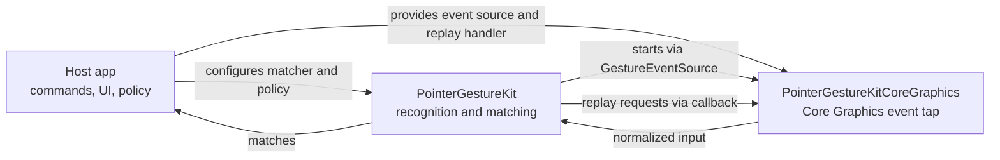

# PointerGestureKit

[](https://github.com/naviapps/pointer-gesture-kit/actions/workflows/ci.yml)
[](LICENSE)
[](https://swiftpackageindex.com/naviapps/pointer-gesture-kit)
[](https://swiftpackageindex.com/naviapps/pointer-gesture-kit)

PointerGestureKit recognizes pointer-button drag gestures on macOS.
It provides a platform-neutral recognizer core plus a Core Graphics event-tap adapter for apps
that want to turn pointer-button drag paths into app-owned command matches. It defaults to the
secondary button and can be configured for primary, middle, or additional pointer buttons.
Gesture movement is recorded as one of four cardinal directions: up, down, left, and right.
Movement without a dominant axis does not add a direction.
`GesturePoint` values use gesture coordinates where positive vertical movement resolves as down.

The core `PointerGestureKit` product owns direction recognition, matching, gesture-session state,
observation, event-disposition modeling, event-source start retry behavior, and platform-neutral
event-source contracts. The `PointerGestureKitCoreGraphics` product owns the live macOS Core
Graphics event-tap bridge and replay adapter. Host apps own commands, UI, Accessibility permission
presentation, persistence, telemetry, and product policy.



## Requirements

- macOS 14 or later
- Swift 6.0 or later

## Installation

Add this package to your Swift Package dependencies:

```swift
.package(url: "https://github.com/naviapps/pointer-gesture-kit.git", from: "0.1.0")
```

Then add the library product you need to your target:

```swift
.product(name: "PointerGestureKit", package: "pointer-gesture-kit"),
.product(name: "PointerGestureKitCoreGraphics", package: "pointer-gesture-kit")
```

Use `PointerGestureKit` for the recognizer core and platform-neutral contracts. Add
`PointerGestureKitCoreGraphics` only when the target needs the live macOS Core Graphics event tap.

## Documentation

- [PointerGestureKit API reference](https://swiftpackageindex.com/naviapps/pointer-gesture-kit/documentation/pointergesturekit)
- [PointerGestureKitCoreGraphics API reference](https://swiftpackageindex.com/naviapps/pointer-gesture-kit/documentation/pointergesturekitcoregraphics)

## Basic Usage

Define the app-owned command type and the direction patterns that should trigger it:

```swift
import PointerGestureKit

enum AppCommand: Sendable {
  case showInspector
  case focusSearch
}

@MainActor
func makeGestureMatcher() -> GesturePatternMatcher<AppCommand> {
  var matcher = GesturePatternMatcher<AppCommand>()
  matcher.register(pattern: [.down, .right], match: .showInspector)
  matcher.register(pattern: [.up, .left], match: .focusSearch)
  return matcher
}

@MainActor
func run(_: AppCommand) {
}
```

Pattern matching is exact: the completed gesture direction sequence must match a registered pattern.
Use `GesturePatternCatalog` when a host-owned settings UI needs to validate configured patterns
before building a matcher; it reports empty patterns and duplicate patterns, but shared prefixes are
valid because matching is exact. The catalog validates only pattern shape; host apps still own
command names, command conflicts, persistence, and migration policy.
`GesturePatternMatcher.register(pattern:match:)` returns `false` for empty patterns and otherwise
stores or replaces the exact pattern match.

Provide app-specific callbacks, policy, and optional tuning through
`GestureRecognizerConfiguration`:

```swift
import PointerGestureKit
import PointerGestureKitCoreGraphics

@MainActor
let eventTap = GestureEventTap()

@MainActor
let configuration = GestureRecognizerConfiguration<AppCommand>(
  makeMatcher: { _ in makeGestureMatcher() },
  onReplayRequested: eventTap.replay,
  onMatch: { command in
    run(command)
  },
  areModifiersSatisfied: { modifiers, _ in
    modifiers.contains(.command)
  }
)
```

`onReplayRequested` emits replay requests for consumed pointer-button input. Plain clicks request
a full click for the configured recognition button. Unmatched or recording-mode drags request the
consumed drag sequence so primary-button drawing and other drag workflows can be restored.
Matched gestures request only the consumed button release after the host handles the command.
Stopping or cancelling while consumed pointer-button input is active also requests the replay
needed to leave host input state consistent.

The default recognition button is `.secondary`. For a non-default recognition button, configure
both the recognizer and the Core Graphics adapter with the same button:

```swift
let eventTap = GestureEventTap(capturedButtons: [.primary])

let configuration = GestureRecognizerConfiguration<AppCommand>(
  makeMatcher: { _ in makeGestureMatcher() },
  onReplayRequested: eventTap.replay,
  onMatch: { command in
    run(command)
  },
  recognitionButton: .primary
)
```

Passing an empty `capturedButtons` set to `GestureEventTap` captures no input and causes
`start(handler:)` to return `false`; use the default initializer when secondary-button capture is
intended.

Create and start the recognizer:

```swift
@MainActor
let recognizer = GestureRecognizer(
  eventSource: eventTap,
  configuration: configuration
)

recognizer.start()
```

The recognizer is `@MainActor` isolated. Drive it from main-actor UI/application code.
`GestureEventTap.start(handler:)` returns `false` when no pointer buttons are configured or when the
tap cannot be created, commonly because the host app has not been granted Accessibility permission.
PointerGestureKit reports that through recognizer lifecycle/failure state: `.failed` means no retry
is scheduled, while `.retrying` means the configured event-source start retry schedule is active.
`status.lastFailure` exposes startup, policy, modifier, and session-expiration failures. The host
app owns permission presentation, copy, and onboarding UI.

Omit `recognitionContext` when gestures do not depend on app, window, or surface identity.
Provide it when matching or enablement policy changes by host context. If only the current frontmost
app matters, ignore the point argument. Return `nil` when no host context is active.
`GestureRecognitionContext(identifier:)` trims surrounding whitespace and returns `nil` for blank
identifiers. Use `isRecognitionEnabled` when a valid context exists but should not currently accept
gestures.

Set `isRecordingModeEnabled` only while teaching or recording a gesture pattern. Recording mode
captures directions without requiring modifier approval or a registered match, but it still respects
`isRecognitionEnabled` for the active context. Normal recognition mode also uses
`areModifiersSatisfied` and the configured matcher. A completed recording-mode drag still emits a
consumed drag-sequence replay request for the configured recognition button.

Use the default `GestureRecognizerTuning` unless the host app needs different movement thresholds,
session expiration, raw trace retention, or event-source start retry delays.

## Lifecycle

Use `start()` to request event-source startup and `stop()` to stop recognition, cancel pending
startup retries, clear active gesture state, and reset the last failure. Use `retryStartNow()` only
after a previous `start()` request when the host wants to retry event-source startup immediately.
Use `cancelActiveGesture()` for user-driven cancellation of an in-progress gesture; when no gesture
session or pending button input exists, it is a no-op and preserves the current failure state.

## Observation

Use `observe`, `observeStatus`, or `observeTrace` to update UI without reaching into recognizer
internals:

```swift
@MainActor
func renderTrace(
  points: [GesturePoint],
  directions: [GestureDirection],
  directionEndpoints: [GesturePoint]
) {
}

let token = recognizer.observeTrace { state in
  renderTrace(
    points: state.rawPoints,
    directions: state.directions,
    directionEndpoints: state.directionEndpoints
  )
}
```

Keep the returned `GestureObservationToken` for as long as the observation should remain active.
Cancelling or releasing the token removes the observer.
`observeStatus` and `observeTrace` emit their initial value immediately, then emit only when that
portion of the snapshot changes.
Use `status.lifecycle` for event-source startup UI. Use `status.isCapturingGesture` for active
gesture capture state and `status.isRecordingModeEnabled` for the host-controlled
teaching/recording mode. Use `status.lastRecordedDirections` to read the most recently completed
direction sequence, including recording-mode captures. `trace.directionEndpoints` contains the
trace start point plus one normalized endpoint per direction for rendering gesture paths.

## Responsibility Boundary

PointerGestureKit intentionally does not own:

- command catalogs, shortcuts, or action execution
- trace rendering UI
- Accessibility permission presentation, copy, or onboarding UI
- app-specific gesture enablement policy
- persistence, syncing, telemetry, or analytics
- non-macOS event-source adapters
- support for diagonal gesture directions

Those concerns should stay outside this package.

## Development

Local development commands use `make`.

Run all local checks:

```sh
make check
```

For focused local work, run `make format`, `make lint`, `make test`, `make build`, or `make docc`.
GitHub Actions runs `make check` on pull requests and pushes to `main`.

## Security

Report vulnerabilities privately. See [SECURITY.md](SECURITY.md).

## License

PointerGestureKit is released under the MIT License. See [LICENSE](LICENSE).
