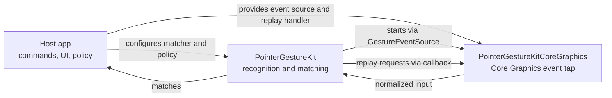

# PointerGestureKit

[](https://github.com/naviapps/pointer-gesture-kit/actions/workflows/ci.yml)
[](LICENSE)
[](https://swiftpackageindex.com/naviapps/pointer-gesture-kit)
[](https://swiftpackageindex.com/naviapps/pointer-gesture-kit)

PointerGestureKit recognizes pointer-button drag gestures on macOS.
It provides a platform-neutral recognizer core plus a Core Graphics event-tap adapter for apps
that want to turn pointer-button drag paths into app-owned command matches. It defaults to the
secondary button and can be configured for primary, middle, or auxiliary pointer buttons.
Gesture movement is recorded as one of four cardinal directions: up, down, left, and right.
Movement without a dominant axis does not add a direction.
`GesturePoint` values use gesture coordinates where positive vertical movement resolves as down.
The recognizer passes through input with non-finite coordinates.

The core `PointerGestureKit` product owns direction recognition, matching, gesture-input state,
observation, event-disposition modeling, event-source start retry behavior, and platform-neutral
event-source contracts. The `PointerGestureKitCoreGraphics` product owns the live macOS Core
Graphics event-tap bridge and replay adapter. Host apps own commands, UI, Accessibility permission
presentation, persistence, telemetry, and product policy.



## Requirements

- macOS 14 or later
- Swift 6.2 or later

## Installation

Add this package to your Swift Package dependencies:

```swift
.package(url: "https://github.com/naviapps/pointer-gesture-kit.git", from: "0.2.0")
```

Then add the library product you need to your target:

```swift
.product(name: "PointerGestureKit", package: "pointer-gesture-kit"),
.product(name: "PointerGestureKitCoreGraphics", package: "pointer-gesture-kit")
```

Use `PointerGestureKit` for the recognizer core and platform-neutral contracts. Add
`PointerGestureKitCoreGraphics` only when the target needs the live macOS Core Graphics event tap.

Convert between Core Graphics points and neutral gesture points at the adapter boundary:

```swift
import CoreGraphics
import PointerGestureKit
import PointerGestureKitCoreGraphics

let gesturePoint = GesturePoint(CGPoint(x: 10, y: 20))
let cgPoint = gesturePoint.cgPoint
```

The Core Graphics bridge preserves finite coordinate values without flipping axes; platform-specific
screen or view coordinate transforms belong in the host app.

## Documentation

- [PointerGestureKit API reference](https://swiftpackageindex.com/naviapps/pointer-gesture-kit/documentation/pointergesturekit)
- [PointerGestureKitCoreGraphics API reference](https://swiftpackageindex.com/naviapps/pointer-gesture-kit/documentation/pointergesturekitcoregraphics)

## Basic Usage

Define the app-owned command type and the direction patterns that should trigger it:

```swift
import PointerGestureKit

enum AppCommand: Sendable {
  case showInspector
  case focusSearch
}

@MainActor
func makeGestureMatcher() -> GesturePatternMatcher<AppCommand> {
  var matcher = GesturePatternMatcher<AppCommand>()
  matcher.register(pattern: [.down, .right], match: .showInspector)
  matcher.register(pattern: [.up, .left], match: .focusSearch)
  return matcher
}

@MainActor
func run(_: AppCommand) {
}
```

Pattern matching is exact: the completed gesture direction sequence must match a registered pattern.
`GesturePatternMatcher.register(pattern:match:)` returns `false` for an empty pattern. Otherwise it
stores the exact match and returns `true`; registering the same pattern again intentionally replaces
the previous match. Host apps own duplicate-rule policy, command conflicts, persistence, and settings
lifecycle.

Provide app-specific callbacks, policy, and optional tuning through
`GestureRecognizerConfiguration`:

```swift
import CoreGraphics
import PointerGestureKit
import PointerGestureKitCoreGraphics

@MainActor
func makeRecognizer() -> GestureRecognizer<AppCommand> {
  let eventTap = GestureEventTap()
  let initialLocation = GesturePoint(CGPoint(x: 0, y: 0))
  _ = initialLocation.cgPoint

  let configuration = GestureRecognizerConfiguration<AppCommand>(
    makeMatcher: { _ in makeGestureMatcher() },
    onReplayRequested: { request in eventTap.replay(request) },
    onMatch: { command in
      run(command)
    },
    areModifiersSatisfied: { modifiers, _ in
      modifiers.contains(.command)
    }
  )

  return GestureRecognizer(
    eventSource: eventTap,
    configuration: configuration
  )
}
```

`makeMatcher` returns the exact-pattern matcher for the active recognition context. Recording mode
records directions without requesting a matcher.
`onReplayRequested` emits replay requests for consumed pointer-button input. Plain clicks request
a full click for the configured recognition button. Unmatched or recording-mode drags request the
consumed drag sequence so primary-button drawing and other drag workflows can be restored.
Matched gestures request only the consumed button release after the host handles the command.
Stopping or cancelling while consumed pointer-button input is active also requests the replay
needed to leave host input state consistent.
`GestureEventTap.replay(_:)` maps click requests to button-down and button-up events, drag
requests to down/move/up events, and release requests to button-up events. Empty drag requests are
ignored by the Core Graphics adapter, and single-point drag requests replay as a click at that point.

The default recognition button is `.secondary`. For a non-default recognition button, configure
both the recognizer and the Core Graphics adapter with the same button:

```swift
import PointerGestureKit
import PointerGestureKitCoreGraphics

@MainActor
func makePrimaryButtonRecognizer() -> GestureRecognizer<AppCommand> {
  let eventTap = GestureEventTap(capturedButtons: [.primary])

  let configuration = GestureRecognizerConfiguration<AppCommand>(
    makeMatcher: { _ in makeGestureMatcher() },
    onReplayRequested: { request in eventTap.replay(request) },
    onMatch: { command in
      run(command)
    },
    recognitionButton: .primary
  )

  return GestureRecognizer(
    eventSource: eventTap,
    configuration: configuration
  )
}
```

Use `PointerButton(auxiliaryButtonID:)` only for extra pointer buttons; identifiers `0`, `1`, and
`2` are reserved for `.primary`, `.secondary`, and `.middle`.

Passing an empty `capturedButtons` set to `GestureEventTap` captures no input and causes
`start(handler:)` to return `false`; use the default initializer when secondary-button capture is
intended.

Store the recognizer for as long as recognition should stay active, then start it:

```swift
import PointerGestureKit

@MainActor
final class GestureController {
  private var recognizer: GestureRecognizer<AppCommand>?

  func startRecognition() {
    let recognizer = makeRecognizer()
    self.recognizer = recognizer
    recognizer.start()
  }
}
```

Stop and release the recognizer when the host no longer needs recognition:

```swift
import PointerGestureKit

@MainActor
extension GestureController {
  func stopRecognition() {
    recognizer?.stop()
    recognizer = nil
  }
}
```

The recognizer is `@MainActor` isolated. Drive it from main-actor UI/application code.
`GestureEventTap.start(handler:)` returns `false` when no pointer buttons are configured or when the
tap cannot be created, commonly because the host app has not been granted Accessibility permission.
PointerGestureKit reports that through recognizer lifecycle/failure state:
`GestureRecognizerState.Status.Lifecycle.failed` means no retry is scheduled, while
`GestureRecognizerState.Status.Lifecycle.retrying` means the configured event-source start retry
schedule is active.
`status.lastFailure` exposes startup, enablement-policy, modifier-policy, and input-expiration
failures. The host app owns permission presentation, copy, and onboarding UI.

Omit `recognitionContext` when gestures do not depend on app, window, or surface identity.
Provide it when matching or enablement policy changes by host context. If only the current frontmost
app matters, ignore the point argument. Return `nil` when no host context is active.
`GestureRecognitionContext(identifier:)` trims surrounding whitespace and returns `nil` for blank
identifiers. Use `isRecognitionEnabled` when a valid context exists but should not currently accept
gestures.
`GestureModifierFlags(rawValue:)` uses package-owned modifier bits, not platform modifier masks, and
discards bits that are not command, option, control, or shift.

Set `isRecordingModeEnabled` only while teaching or recording a gesture pattern. Recording mode
captures directions without requiring modifier approval or a matcher, but it still respects
`isRecognitionEnabled` for the active context. Normal recognition mode uses
`areModifiersSatisfied` and the configured matcher. A completed recording-mode drag still emits a
consumed drag-sequence replay request for the configured recognition button. Changes to
`isRecordingModeEnabled` apply to gesture sessions that start after the value changes; an active
session keeps the mode it started with.

Use `GestureRecognizerTuning.standard` unless the host app needs different movement thresholds,
gesture input expiration, raw trace retention, or event-source start retry delays. Create custom
values with `try GestureRecognizerTuning.validated(...)`. Invalid values produce a typed validation
error instead of silently changing recognition or retry behavior.

## Lifecycle

Use `start()` to request event-source startup and `stop()` to stop recognition, cancel pending
startup retries, clear active gesture state, and reset the last failure. Calling `start()` again
after a failed or retrying start request retries startup immediately. Use `retryStartNow()` only
after a previous `start()` request when the host wants an explicit retry command separate from the
normal start action.
Use `cancelActiveGesture()` for user-driven cancellation of an in-progress gesture; when consumed
pointer-button input is active, it requests the replay needed to leave host input state consistent.
When no gesture session or pending button input exists, it is a no-op and preserves the current
failure state.

## Observation

Use `observe`, `observeStatus`, or `observeTrace` to update UI without reaching into recognizer
internals:

```swift
import PointerGestureKit

@MainActor
func observeTrace(from recognizer: GestureRecognizer<AppCommand>) -> GestureObservationToken {
  recognizer.observeTrace { trace in
    renderTrace(
      isVisible: trace.isVisible,
      points: trace.rawPoints,
      directions: trace.directions,
      directionEndpoints: trace.directionEndpoints,
      tailPoint: trace.tailPoint
    )
  }
}

@MainActor
func renderTrace(
  isVisible: Bool,
  points: [GesturePoint],
  directions: [GestureDirection],
  directionEndpoints: [GesturePoint],
  tailPoint: GesturePoint?
) {
  guard isVisible else { return }
}
```

Keep the returned `GestureObservationToken` for as long as the observation should remain active.
Cancelling or releasing the main-actor-isolated token removes the observer.
`observeStatus` and `observeTrace` emit their initial value immediately, then emit only when that
portion of the snapshot changes.
Use `status.lifecycle` for event-source startup UI. Use `status.isCapturingGesture` for active
gesture capture state and `status.isRecordingModeEnabled` for the host-controlled
teaching/recording mode. Use `status.lastRecordedDirections` to read the most recently completed
direction sequence, including recording-mode captures. `trace.directionEndpoints` contains the
trace start point plus one normalized endpoint per direction for rendering gesture paths.
Use `trace.tailPoint` to extend a visible path to the latest pointer point without waiting for
another raw-point batch or direction change.
During normal recognition, `trace.isVisible` becomes true when the current direction sequence is a
valid matcher prefix. Completed matches are still exact; prefix visibility only controls feedback
while the gesture is in progress. Recording mode still publishes visible trace feedback while
directions are being captured.
`GestureRecognizerState`, `GestureRecognizerState.Status`, and `GestureRecognizerState.Trace` are
constructible so host-owned recognizer protocols and test doubles can use the same snapshot values
without `@testable` imports.
Lifecycle and failure values are finite enums intended for host UI state mapping, not persistence
formats.

## Responsibility Boundary

PointerGestureKit owns platform-neutral recognition values, matching, validation, and recognizer
state. PointerGestureKitCoreGraphics owns the Core Graphics event-tap and replay adapter.
Event-source implementations deliver normalized `GestureInputEvent` values through
`GestureEventSource.start(handler:)` and apply the returned `GestureEventDisposition` to the
original platform event: `.consume` suppresses it, while `.passThrough` leaves it in the platform
event stream.

PointerGestureKit intentionally does not own:

- command catalogs, shortcuts, or action execution
- trace rendering UI
- Accessibility permission presentation, copy, or onboarding UI
- app-specific gesture enablement policy
- persistence, syncing, telemetry, or analytics
- non-macOS event-source adapters
- support for diagonal gesture directions

Those concerns should stay outside this package.

## Development

Run the package check with:

```sh
make check
```

GitHub Actions runs the same check on pull requests and pushes to `main`.

## Contributing

See [CONTRIBUTING.md](CONTRIBUTING.md). Release notes are in [CHANGELOG.md](CHANGELOG.md).

## Security

Report vulnerabilities privately. See [SECURITY.md](SECURITY.md).

## License

PointerGestureKit is released under the MIT License. See [LICENSE](LICENSE).
